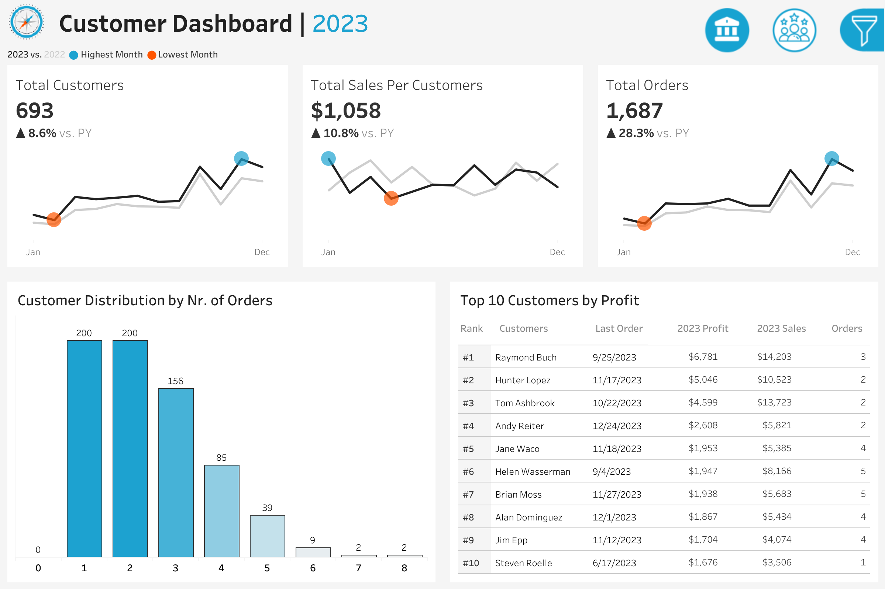
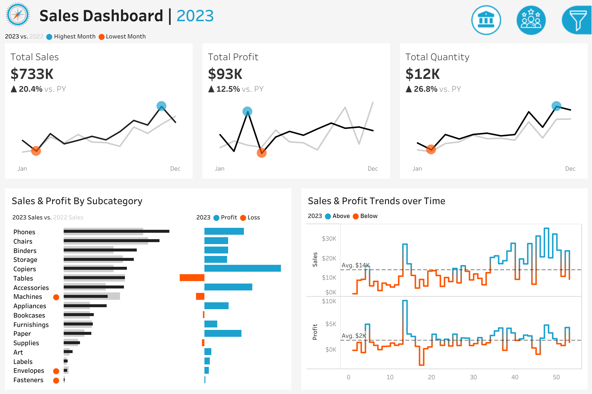

# 📊 Tableau Dashboard Projects

## 🚀 What I Learned

- **Connecting to Data Sources:** Excel, Google Sheets, and Cloud Servers.
- **Building Visuals:** Bar charts, line charts, donut charts, maps, tables, and dual-axis charts.
- **Calculated Fields:** Created custom IF statements.
- **Advanced Features:** Built sets, hierarchies, and groups.
- **Joins:** Understood how joins work in Tableau.
- **Level of Detail (LOD) Calculations:** Mastered creating detailed metrics.
- **Parameters:** Built dynamic dashboards with user inputs.
- **Analytics Pane:** Implemented trend lines and other analytical insights.
- **Dashboard Actions:** Created interactive dashboards for better user engagement.
- **Daily Updating Dashboard:** Integrated with Google Sheets for automatic daily updates.
- **UI/UX Design:** Used Figma to improve dashboard aesthetics.

---

## 📌 Project Dashboards

### 🧠 Customer Dashboard

---

### 📈 Sales Dashboard

---

✅ **Published dashboards online for easy sharing and collaboration.**

